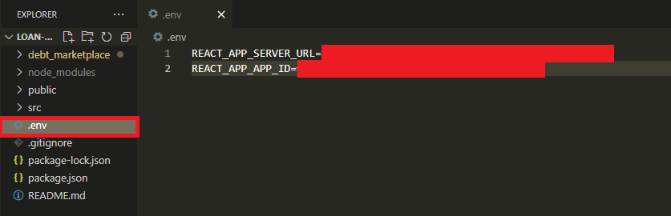
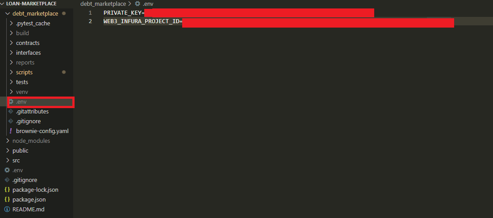

Borrowers can propose loans and lenders can fill them. When a user fills a loan, they become a lender, and have the right to sell a fraction of the loan, or the entire thing. Each loan can have exactly one fractional owner. At most, user can have one active loan or loan proposal at a time. Active loans are loans that have been lent to.  

This project depends heavily on Moralis's SDK and requires a Moralis server to function. A free account can be made -  https://moralis.io/
Also, this project overview assumes you have at least a basic understanding of MetaMask, but if you don't, here's a link to it's documentation - https://metamask.io/faqs/

*Note: 
This setup is done using the Avalanche Testnet Fuji, but any EVM compatible blockchain will work.*

# Setup steps <br>
### 1) Connect your MetaMask to the Avalanche Testnet Fuji: <br>
-   **Network Name**: Avalanche FUJI C-Chain <br>
-   **New RPC URL**:  https://api.avax-test.network/ext/bc/C/rpc <br>
-   **ChainID**:  43113<br>
-   **Symbol**:  AVAX<br>
-   **Explorer**:  https://testnet.snowtrace.io/ <br>

### 2) Create Moralis server on the Avalanche Test network:  <br>
Instructions can be found: https://docs.moralis.io/moralis-server/getting-started <br>
<br>
### 3) Clone repository <br>
```
git clone https://github.com/McManOfTheLand/Loan-Marketplace.git
```
### 4) Create .env files <br>
In the root of your project directory, create a .env file and add your Moralis Server URL and Application ID. 

<br>
In the projects debt_marketplace directory, add another .env file, but this time add your private key and your Web3 provider URL.

<br>
### 5) Install node dependencies <br>
While in the project's root directory, run the command:
```
npm install
```
 ### 6)  Deploy Smart Contract <br>
 While in the project's root directory, run the command:
```
brownie run scripts/deploy_loans.py --network avax-testnet
```
 ### 7)  Connect smart contract to front end <br>
 In order to connect the projects front end with our smart contract, the contract's abi, and it's address are needed. Assuming that the contracts source code has not been modified, it's unnecessary to change it since it's already provided in the  **Loan-Marketplace/src/ContractInfo/abi.js** folder. In the same folder, there is a file called **address.js**. Add your contract instance address to the specified area.<br>
<br>
### 8) Launch dapp <br>
In project's root directory, run the command:<br>
```
npm start
```
Once open, you will see:
ADD PHOTO<br>

# Navigating the dapp <br>
 ### 1) Propose Loan <br>
 Users can make a loan proposal, but can have only one at most.
 ### 2) Browse Loans <br>  
 Users can view and fill loan proposals, but can only lend to one loan at a time. 
 ### 3) Browse Fractional Loans <br> 
 Users can view and buy fractions of loans. These fractions are sold by the lender to the original loan. 
 ### 4) Users Positions 
 If applicable, users can view or delete their loan proposals, view their fractional loans, and payback their active loans.
 
 # For a detailed demo on the entirety of the dapp, watch this video:
