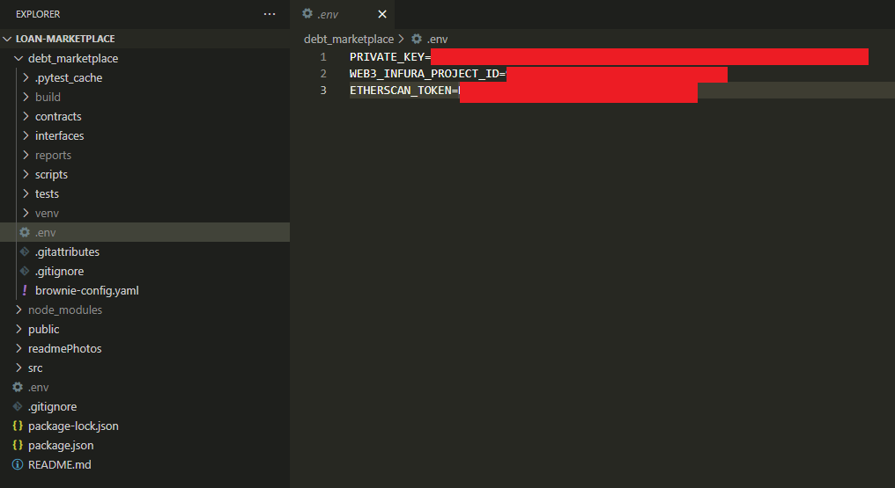

# Simple Loan Marketplace <br>

Borrowers can propose loans and lenders can fill them. If a proposal is filled, the lender has the right to sell, for any price in ether, that loan to a third party. The lender also has the option to sell a fractional percent of the loan at any price. At most, one fractional owner of a given loan is allowed, and therefore, in it's current form, this project won't scale. When a third party buys a fraction of a loan, it is entirey possible that the borrower will never know. A borrower will not be notified if their loan has been sold to a third party, however, if they look up their loan, they will be able to find all information. In essence, the borrower is only given the "need to know" information about their loan. If a loan has multiple owners, the smart contract will hanlde distributing funds correctly to both the fractional buyer, and the original lender.

### Project requirements: <br>
1) Moralis - https://moralis.io/ <br>
2) MetaMask -  https://metamask.io/faqs/ <br>
3) Provider (choose one from below): 
- Infura - https://infura.io/ <br>
- Alchemy - https://www.alchemy.com/ <br>
- Moralis - https://moralis.io/speedy-nodes/ <br>
4) Etherscan API Key - https://etherscan.io/myapikey

# Setup steps <br>

*Note: 
This setup is done using the Rinkeby Testnet, but any EVM compatible blockchain will work.* <br>

### 1) Connect your MetaMask to the Rinkeby Test Network: <br>
-   **Network Name**: `Rinkeby Test Network` <br>
-   **New RPC URL**: `https://rinkeby.infura.io/v3/9aa3d95b3bc440fa88ea12eaa4456161` <br>
-   **ChainID**: `4` <br>
-   **Symbol**: `ETH` <br>
-   **Explorer**: `https://rinkeby.etherscan.io` <br>

### 2) Create Moralis server on the Rinkeby Test network:  <br>
Instructions can be found: https://docs.moralis.io/moralis-server/getting-started <br>
<br>
### 3) Clone repository <br>
```
git clone https://github.com/McManOfTheLand/Loan-Marketplace.git
```
### 4) Create .env files <br>
In the root of your project directory, create a .env file and add your Moralis Server URL and Application ID. 

<br>
In the projects debt_marketplace directory, add another .env file, but this time add your private key and your Web3 provider URL. Moralis has their own node providers, but you are free to use any provider you wish as long as it's for the Rinkey testnet.

<br>
### 5) Install node dependencies <br>
While in the project's root directory, run the command:
```
npm install
```
 ### 6)  Deploy Smart Contract <br>
 While in the project's root directory, run the command:
```
brownie run scripts/deploy_loans.py --network rinkeby
```
 ### 7)  Connect smart contract to front end <br>
 In order to connect the front end to the smart contract, the contract's abi, and it's address are needed. Assuming that the contracts source code has not been altered since cloning, the contracts abi can be found - **Loan-Marketplace/src/ContractInfo/abi.js**. In the same directory, there is a file called **address.js**. Add your deployed contract instance address to the specified area.<br>
<br>
### 8) Launch dapp <br>
In project's root directory, run the command:<br>
```
npm start
```
Once open, you will see:
ADD PHOTO<br>

# Navigating the dapp <br>
 ### 1) Propose Loan <br>
 Users can make a loan proposal, but can have only one at most.
 ### 2) Browse Loans <br>  
 Users can view and fill loan proposals, but can only lend to one loan at a time. 
 ### 3) Browse Fractional Loans <br> 
 Users can view and buy fractions of loans. These fractions are sold by the lender to the original loan. 
 ### 4) Users Positions 
 If applicable, users can view or delete their loan proposals, view their fractional loans, and payback their active loans.
 

